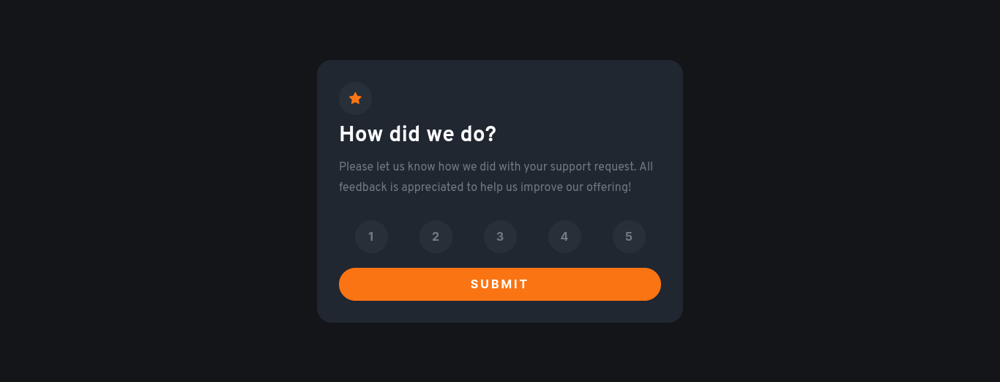
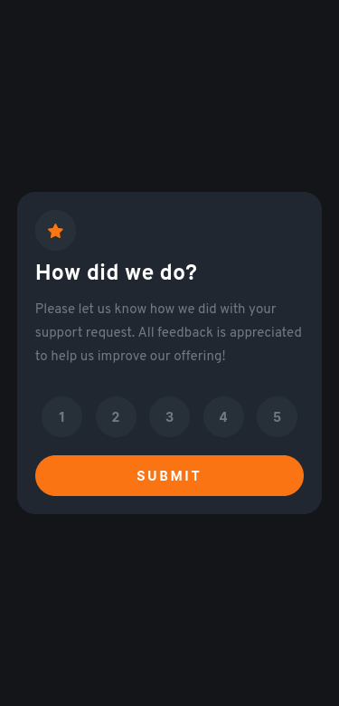

# Frontend Mentor - Interactive rating component solution

This is a solution to the [Interactive rating component challenge on Frontend Mentor](https://www.frontendmentor.io/challenges/interactive-rating-component-koxpeBUmI). Frontend Mentor challenges help you improve your coding skills by building realistic projects.

## Table of contents

- [Overview](#overview)
  - [Screenshot](#screenshot)
  - [Links](#links)
  - [My Process](#my-process)
  - [Built with](#built-with)
  - [What I learned](#what-i-learned)
  - [CSS code](#css)
  - [JS code](#javascript)
  - [Useful resources](#useful-resources)
- [Author](#author)
- [Acknowledgments](#acknowledgments)

**Note: Delete this note and update the table of contents based on what sections you keep.**

## Overview

### Screenshot

## Desktop



## Mobile



### Links

- Solution URL: [Github](https://github.com/kentbuno/Interactive-Rating-Component)
- Live Site URL: [Vercel](https://interactive-rating-component-sage-phi.vercel.app/)

## My process

### Built with

- Semantic HTML5 markup
- CSS custom properties
- Flexbox
- CSS Grid
- Mobile-first workflow

### What I learned

I learned more about flexbox, grid, hover effects, media queries, and more.

When it comes to difficulty, I had a hard time figuring out the pixel sizes, especially on Javascript, because I am still a beginner and just learned the basic fundamentals of it, but overall it was a fun challenge.

Any comments about my code are well appreciated and will be implemented in my future projects.

## CSS

```css
/*--- Reset default values ---*/
*,
*::before,
*::after {
  box-sizing: border-box;
}

body,
h1,
h2,
h3,
h4,
p,
li,
figure,
figcaption,
blockquote,
dl,
dd {
  margin: 0;
}

html:focus-within {
  scroll-behavior: smooth;
}

img {
  max-width: 100%;
  display: inline-block;
}

:root {
  --body-bg: hsl(228, 11%, 9%);
  --main-bg: hsl(215, 21%, 16%);
  --btn-color: hsl(25, 97%, 53%);
  --text-color: hsl(215, 7%, 48%);
}

body {
  min-height: 100vh;
  background-color: var(--body-bg);
  color: hsl(0, 0%, 100%);
  font-family: "Overpass", sans-serif;
  display: grid;
  place-items: center;
}

main {
  width: min(90%, 25rem);
  background-color: var(--main-bg);
  padding: 1.25rem;
  border-radius: 1.25rem;
}

h1 {
  margin-block: 0.625rem;
  font-size: 1.5625rem;
}

p {
  color: var(--text-color);
  line-height: 1.75;
  font-size: 0.9375rem;
}

button {
  color: white;
  background-color: #273039;
  border: none;
  height: 2.8125rem;
  width: 2.8125rem;
  border-radius: 50%;
  font-size: 0.875rem;
  font-weight: 700;
  color: var(--text-color);
}

button[type="submit"] {
  border-radius: 1.5625rem;
  width: 100%;
  background-color: var(--btn-color);
  text-transform: uppercase;
  font-weight: 700;
  letter-spacing: 0.1875rem;
  color: white;
}

h2 {
  margin-bottom: 1rem;
}

.star {
  width: 2.8125rem;
  height: 2.8125rem;
  background-color: #273039;
  border-radius: 50%;
  display: grid;
  place-items: center;
}

.rating-container {
  width: 100%;
  display: flex;
  justify-content: space-around;
  padding-block: 1.875rem 1.25rem;
}

.gratitude-section {
  text-align: center;
}

.selected-rating {
  background-color: #273039;
  color: var(--btn-color);
  padding: 0.5em 1em;
  border-radius: 3.125rem;
  width: fit-content;
  margin: 1.25rem auto;
}

.hide {
  display: none;
  pointer-events: none;
}

button:hover,
button:focus,
.style {
  color: var(--btn-color);
  transform: scale(1.1);
  transition: all 0.5s ease;
  cursor: pointer;
}

button[type="submit"]:hover,
button[type="submit"]:focus {
  color: white;
  transform: scale(1.025);
}

@media only screen and (min-width: 63.75rem) {
  p {
    font-size: 1rem;
  }

  h1 {
    font-size: 1.875rem;
  }

  main {
    width: 31.25rem;
    padding: 1.875rem;
  }
  button {
    font-size: 1rem;
  }
}
```

## Javascript

```js
const submit = document.querySelector('button[type="submit"]');
const gratitudeSection = document.querySelector(".gratitude-section");
const ratingSection = document.querySelector(".rating-section");
const ratingBtn = document.querySelectorAll(".rate");
const ratingEl = document.querySelector(".rating");

for (let btn = 0; btn < ratingBtn.length; btn++) {
  ratingEl.textContent = 0;
  ratingBtn[btn].addEventListener("click", function () {
    if (btn === 0) {
      ratingEl.textContent = 1;
    } else if (btn === 1) {
      ratingEl.textContent = 2;
    } else if (btn === 2) {
      ratingEl.textContent = 3;
    } else if (btn === 3) {
      ratingEl.textContent = 4;
    } else if (btn === 4) {
      ratingEl.textContent = 5;
    }
  });
}

const showMessage = function () {
  ratingSection.classList.add("hide");
  gratitudeSection.classList.remove("hide");
};
submit.addEventListener("click", showMessage);
```

### Useful resources

- [W3Schools](https://www.w3schools.com/w3css/defaulT.asp) - This is my HTML and CSS reference.
- [MDN Web Docs](https://developer.mozilla.org/en-US/docs/Web/JavaScript) - This my Javascript reference.

**Note: Delete this note and replace the list above with resources that helped you during the challenge. These could come in handy for anyone viewing your solution or for yourself when you look back on this project in the future.**

## Author

- Frontend Mentor Profile - [@kentbuno](https://www.frontendmentor.io/profile/kentbuno)

## Acknowledgments

I want to personally thank the [Frontend Mentor](https://www.frontendmentor.io/home) website because it helps me learn and helps my learning journey enjoyable.

I also want to thank the people who commented on my previous challenge for their suggestions. I really appreciate them. 😊
